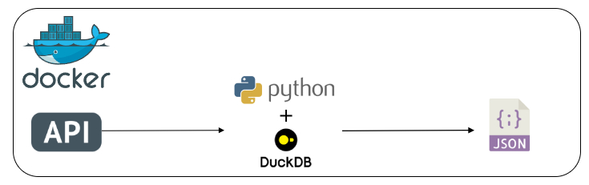

# Projeto Engenharia de dados: Consumo de dados via API

## Introdução

Este projeto tem como objetivo desenvolver uma automação que seja capaz de coletar dados da Fake Store API, processá-los e armazená-los em um arquivo final no formato JSON. A solução será implementada em Python, utilizando conceitos de programação orientada a objetos (POO) e seguindo boas práticas de codificação para facilitar a manutenção e legibilidade do código.

## Tecnologias Utilizadas
- **Python**: Linguagem de programação para fazer requisições à API e processar dados.
- **Duckdb**: Banco de dados analítico leve e embutido, utilizado para realizar transformações e consultas intermediárias nos dados coletados antes do armazenamento final.
- **Pandas**: Utilizado para transformar o json em dataframe.
- **Docker**: Utilizado para criar os contêineres que irá hospedar o ambiente Python.

 
 
 
 

## Arquitetura

## Etapas da construção do projeto

### 1. Análise da documentação da API
Para este projeto, foi essencial estudar a documentação da API Fake Store para compreender o funcionamento dos endpoints e como realizar as requisições. A API oferece suporte para métodos de requisição GET e POST; no entanto, neste projeto, utilizaremos apenas o método GET para obter os dados necessários.

### 2. Lógica da requisição da API
A classe [Api](src/classes/api.py) foi construída para facilitar a interação com a API. Ela encapsula a lógica de requisições HTTP, o que permite realizar requisições de maneira organizada para vários endpoints e com tratamento de erros. 

### 3. Lógica para tratamento dos dados
A classe [Tratamento_dados](src/classes/tratamento_dados.py) recebe uma lista de JSONs diretamente da API. Utilizando o pandas, cada JSON da lista é transformado em um DataFrame. Em seguida, cada DataFrame é nomeado de forma única e registrado como uma tabela no DuckDB. Isso permite que os dados sejam transformados e manipulados diretamente por meio de consultas SQL. Ao final, os dados processados são armazenados em um arquivo final no formato JSON.

## Pré-Requisitos

É necessário ter o Docker instalado.

## Executando o Projeto

Siga os passos abaixo para executar este projeto:

1. Copie o diretório do projeto para uma pasta local em seu computador.
2. Abra o terminal do seu computador e mova até o diretório do projeto.
3. Crie a imagem do container do Python executando o seguinte comando: `docker build -t python_image .`
4. Após a criação da imagem, basta executar o seguinte comando `docker run -v "$(pwd):/code" python_image`
